# 👥 Integrantes del Grupo
- Demichelis, Agustín  
- Gimenez Silva, Enzo Daniel
---

# Repositorio en Github
https://github.com/demichelisgimenez/Mi_Ciudad.git

# 📱 Mi Ciudad
Aplicación móvil desarrollada en **React Native con Expo** para la materia **Desarrollo de Aplicaciones Móviles (TUDW - UNER)**.  
El objetivo es brindar a los ciudadanos acceso rápido a información local (farmacias, escuelas, radios, etc.), junto con utilidades como notas, lector QR y un sistema de autenticación.

---

## 🚀 Pantallas Implementadas

### 🏠 Inicio
Pantalla principal con un módulo de **clima en Federal** y accesos rápidos a todas las secciones mediante un menú visual en cuadrícula.

### 💊 Farmacias
Muestra un listado básico de farmacias locales (nombre y espacio reservado para dirección/contacto).

### 🏫 Escuelas
Diseñada para visualizar las instituciones educativas de la ciudad. Por ahora muestra nombres a modo de referencia.

### 📻 Radios
Sección para listar radios FM locales. Próximamente incluirá la funcionalidad de reproducción en vivo.

### 📝 Notas
Pantalla destinada a crear y organizar notas personales.

### 📷 QR
**Funcional**: permite escanear un código QR y abrir directamente el enlace detectado.

### ⚙️ Ajustes
Incluye:
- Recibir notificaciones.
- Botón para cambiar entre **tema claro y oscuro**.  
Ambos implementados como botones funcionales.

### 🔐 Iniciar Sesión
Flujo de autenticación con:
- Formulario de **inicio de sesión** (validación básica).
- Pantalla de **registro de usuario**.  

---

## 📷 Capturas de Pantalla

### Inicio
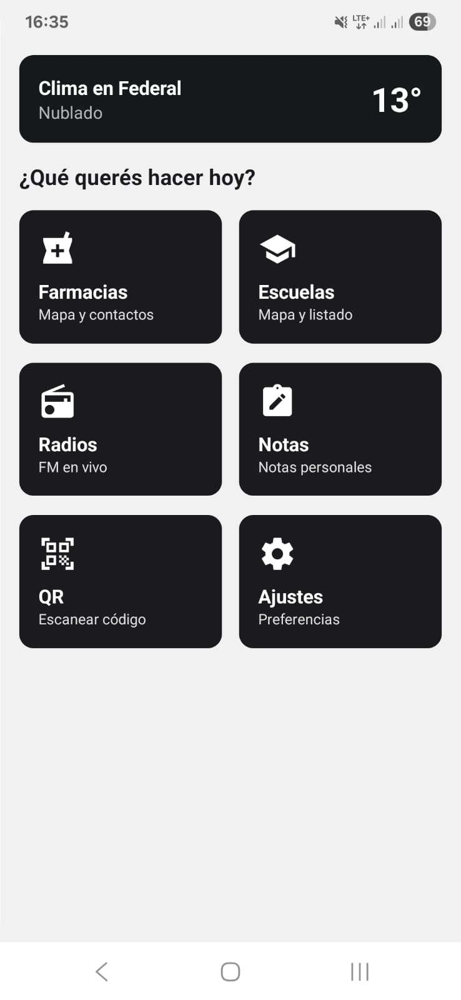

### Farmacias
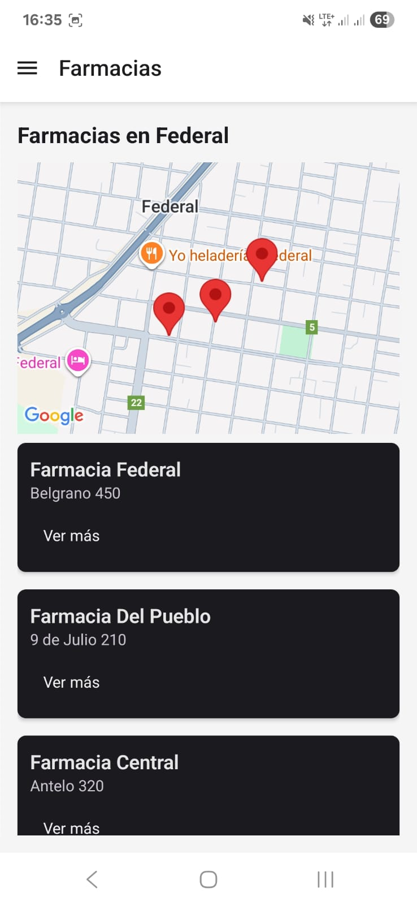

### Escuelas
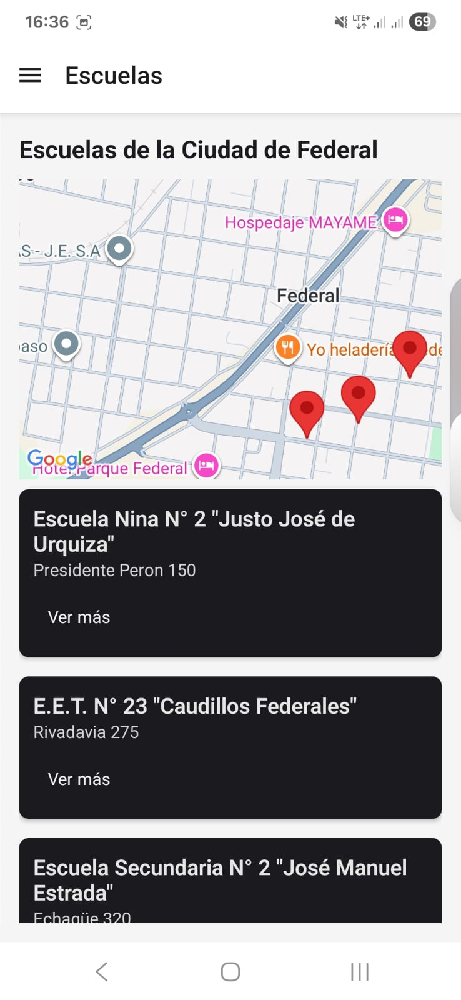

### Radios
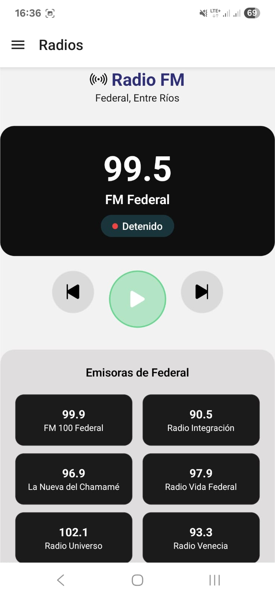
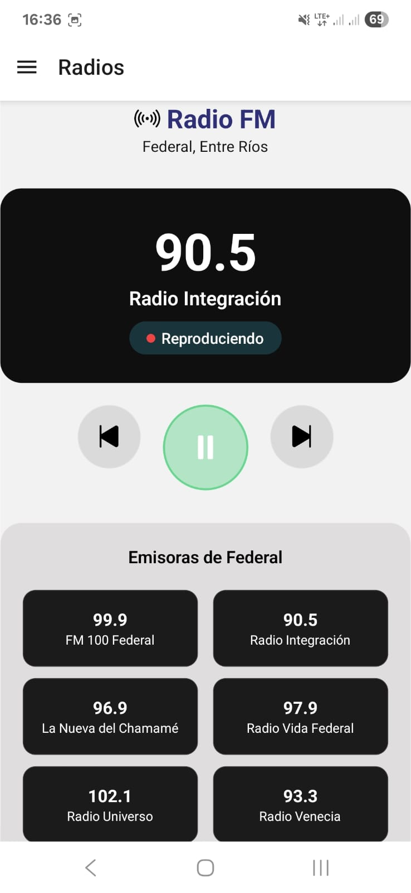
### Notas

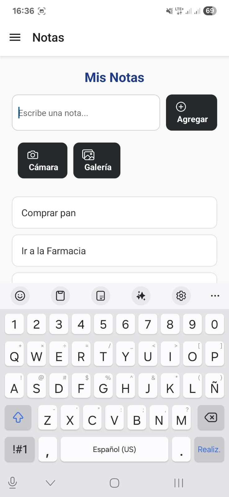

### QR
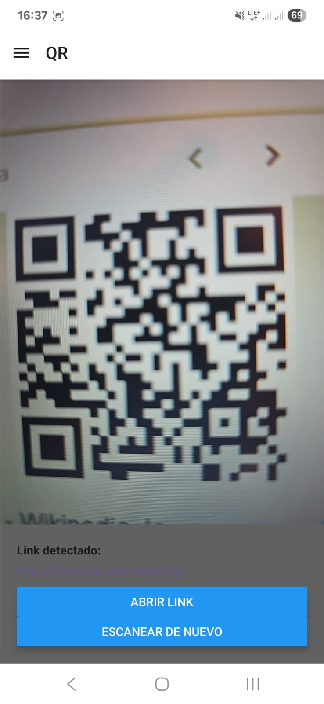

### Ajustes
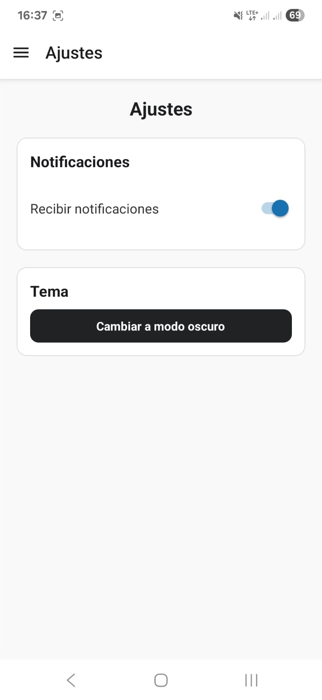

### Login / Registro
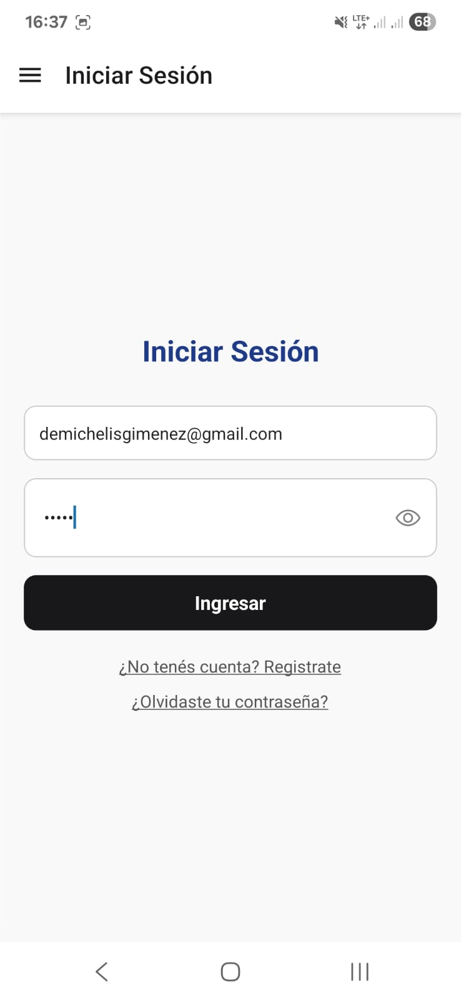
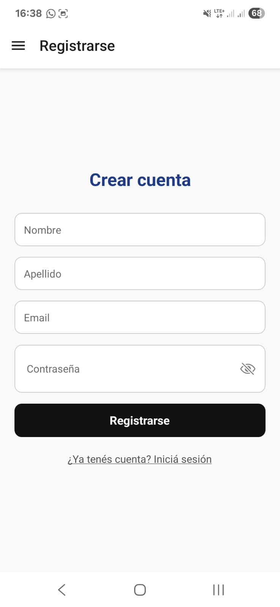

### Drawer
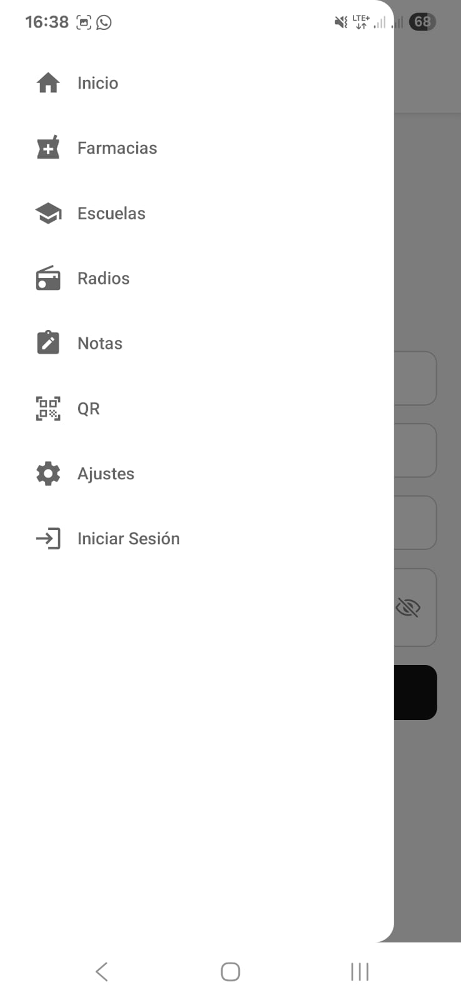

---

